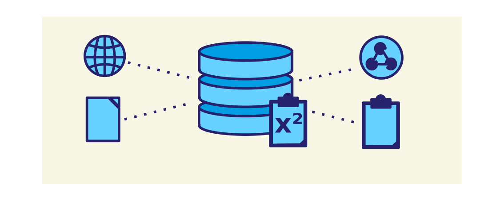

# Extensible Clipboard
This is the improved repository of Extensible Clipboard, 
which has been initially developed by Matthias Rösl. 

Extensible Clipboard is a web-transparent extension of the
traditional clipboard, enabling users enhanced functionality 
and the capability to create own applications, tapping into 
the functionality of the system clipboard.

🚨 Running extensible clipboard is currently **not supported on OS X platforms** due to 
restrictions of the PyQT framework. 

🚨 Also, **building will currently not work on Windows platforms**, so please use `fbs run` instead.

## Features
- 🌏  Remotely set the clipboard on multiple systems via HTTP-Requests

- ⏳ Access the clipboard history via HTTP-Requests

- 📋 Full portation of clipboard functionality to REST-interface (e.g. alternative data 
formats)

- 🔒 Control access to your clipboard by whitelisting clients

## Installation
We recommend installing extensible clipboard from the built version, since it is the most convenient way and does not require installing any packages:

- [Download Debian build (23.01.2020)](https://github.com/FelixRDL/extensible-clipboard/suites/416422024/artifacts/1297834)

If you run extensible clipboard for the first time, please initialize it with the 
following commands:

    # Install dependencies for extensible clipboard
    sudo apt-get install python3-venv && \
    sudo apt-get install python3-dev && \
    sudo apt-get install binutils
    # 
    cd ./packaged
    python3 -m venv venv
    source venv/bin/activate
    pip3 install --upgrade pip
    pip3 install -r requirements.txt
 
    
## Building
Before you are able to use the extensible clipboard, you need to build it for your platform:

    # Build extensible clipboard
    cd ./packaged
    source venv/bin/activate
    fbs freeze

If python states, that objdump has not been found, please try installing **binutils** on your system.
    
## Running 
After building the executable, you can run it through the console:

    # Start extensible clipboard
    cd ./packaged
    'target/ExtensibleClipboard/ExtensibleClipboard'
  
It's easy as that!

## Configuring 

### Server Whitelist
The clip/backend server will only accept requests from trusted clipboards. Trusted clipboards
can be defined in ExtensibleClipboard/config/trusted-clients-config.json: Simply add the
IPv4 address of your clipboard device to the list to allow access to the clipboard.

### System
You can adapt extensible clipboard to your needs and workflows by changing the config files 
or passing command line arguments. The following commands will demonstrate some possible 
use cases, that we have encountered

#### Full package
For deploying the complete system with server and clipboard, simply run:

    # Start extensible clipboard full environment
    cd ./packaged
    'target/ExtensibleClipboard/ExtensibleClipboard'

#### Server only
For only running a server, enter:

    # Start extensible clipboard server
    cd ./packaged
    'target/ExtensibleClipboard/ExtensibleClipboard' -nocbs

This may come in handy, if you want to offer a centralized, remote server.

#### Clipboard only
For only running the clipboard, enter:

    # Start extensible clipboard, clipboard-only
    cd ./packaged
    'target/ExtensibleClipboard/ExtensibleClipboard' -nocs -cbsdomain=http://mydomain -cbsport=12345 -cshost=http://myserverdomain:12345/

This configuration is suitable for setups, where you might connect your local 
clipboard to a remote server.

